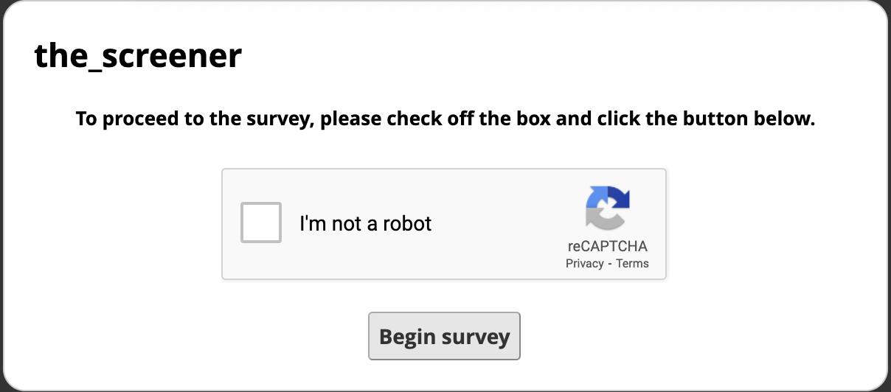
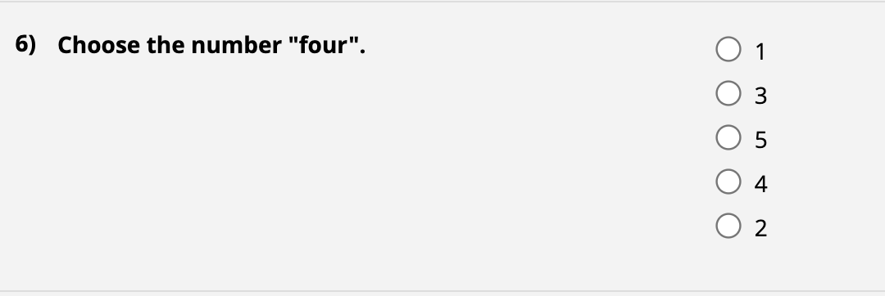
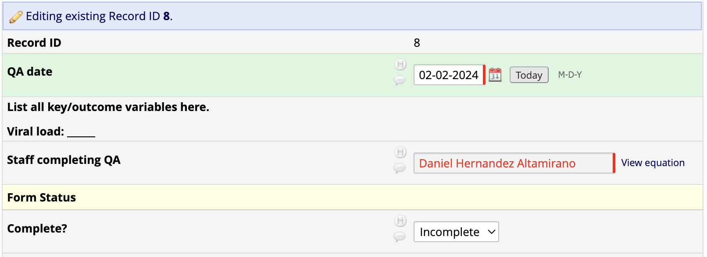
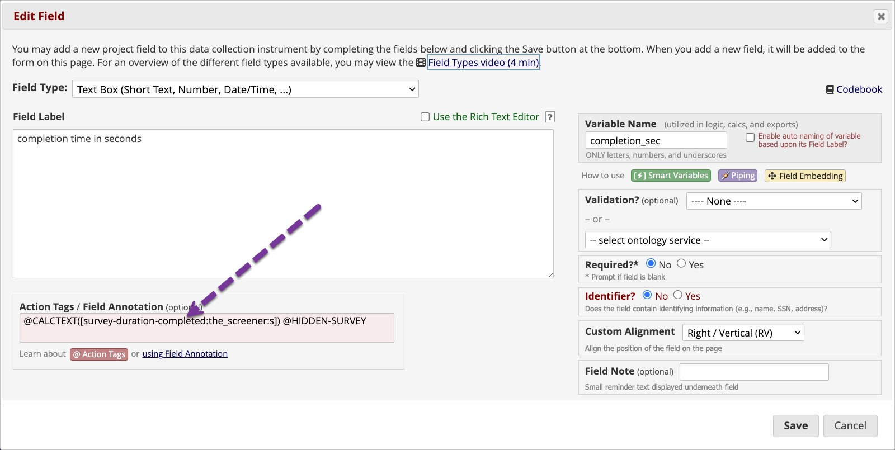
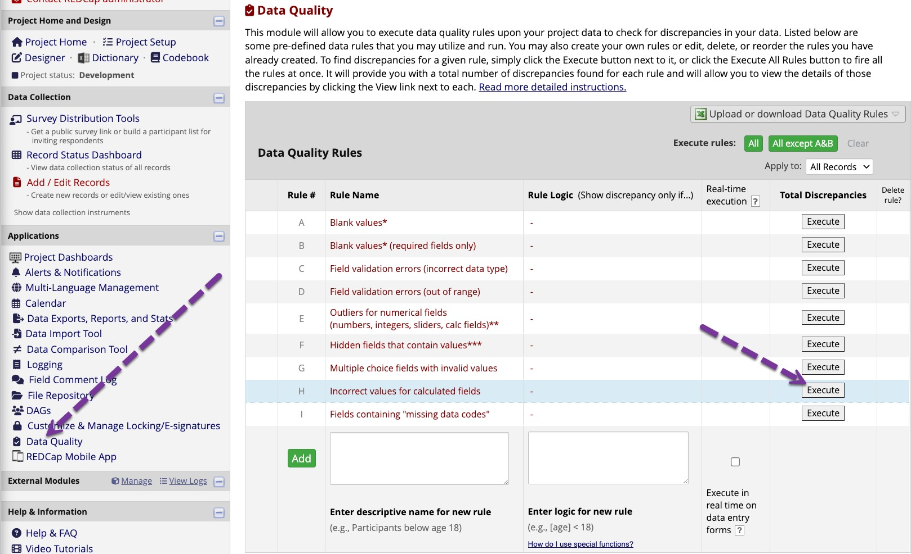
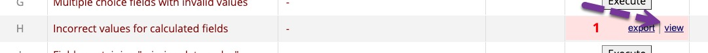
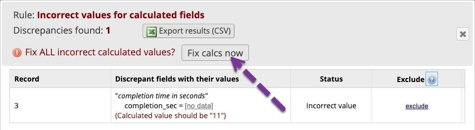
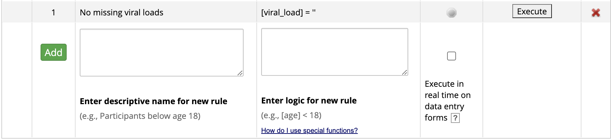
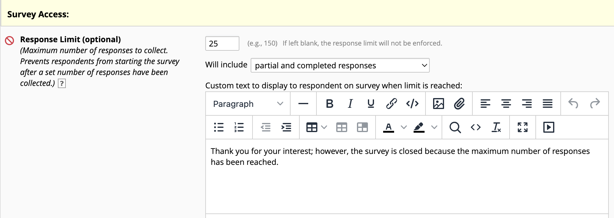
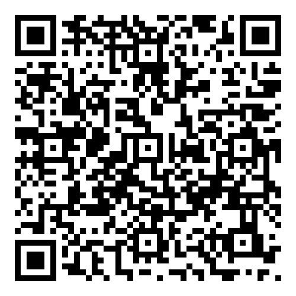

```{r, eval=FALSE, echo=FALSE}
# make pdf of slides
renderthis::to_pdf("./slides.Rmd")
```

# Strategies for Dealing with Bad Actors

```{r echo=FALSE}
red <- function(x){
  if(knitr::is_latex_output())
    paste("\\textcolor{",'red',"}{",x,"}",sep="")
  else if(knitr::is_html_output())
    paste("<font color='red'>",x,"</font>",sep="")
  else
    x
}

colorText <- function(x, color){
  if(knitr::is_latex_output())
    paste("\\textcolor{",color,"}{",x,"}",sep="")
  else if(knitr::is_html_output())
    paste("<font color='",color,"'>",x,"</font>",sep="")
  else
    x
}
```

+ Public facing surveys must deal with .red[bad actors trying to get rewards] from being in your study.
+ We recommend three interrelated types of .red[strategies]:

1. Survey Design
1. Consent & Measures
1. REDCap Monitoring

---
# Strategies Overview
1. Survey Design
  + reCAPTCHA and nedCAPTCHA setup
  + Instruments: field validation & @RANDOMORDER action tag
1. Consent & Measures
  + Consent language
  + Conscientious Responder Scale (attention checks)
1. REDCap Monitoring
  + Hidden trap fields
  + QA forms
  + Survey completion times & data quality rules
  + Response limits

---
# Survey Design

+ Use Google's magic .red[reCAPTCHA] feature
.small[
  + **Survey Distribution Tools** > "Protect the public survey using the Google reCAPTCHA feature"
]
+ Use plug-in modules like .red[nedCAPTCHA]

.pull-left[
.center[
  
reCAPTCHA
]
]

.pull-right[
.center[
  
nedCAPTCHA
]
]

---
# Survey Design

+ Format your project fields to make it easy to .red[spot duplicates]:
  + Use .red[email validation]
  + Use .red[phone number validation]
  + Ask for first and last name in .red[separate] fields

---
# Survey Design
+ Use the `@RANDOMORDER` action tag
  + Scrambles answer choices to deal with people/bots who always choose the .red[same response to every question].
.center[
  ]
  

---
# Consent & Measures

**Consent Language:**
  + Include .red[warning text]:
    + *Data will be screened for multiple submissions and if any are found, ALL entries will be removed.*
    + *All information must be honest, correct, and accurate to be eligible for compensation.*

---
# Consent & Measures

Use the **[Conscientious Responder Scale](https://doi.org/10.1177/2158244014545964)** - Examples:
  1. Choose the first option—”strongly disagree”—in answering this question
  2. Please answer this question by choosing option number two, “disagree”

.red[State that some questions are for fraud detection]

---
# REDCap Monitoring

**Use hidden fields & REDCap reports:**

+ Add a .red[*hidden* email-validated field] named something like "dmy_email" with a label like "Email" and/or a .red[*hidden* email-validated field] named something like "dmy_email2" with a label like "Additional Information". 
    + Use the `@HIDDEN-SURVEY` action tag to create the field(s).
    + Often bots will see "email" in the field name and insert email values.
    + The goal is to create  `r paste("<font color='red'>secret prompts</font>")` that will trick a bot into entering a `r paste("<font color='red'>red flag</font>")`.
+ Create a REDCap .red[alert] that notifies staff when a .red[hidden field is filled].
  
---
# REDCap Monitoring
+ Have a designated staff member do .red[scheduled reviews] of the database with a .red[checklist]:
    + Complete QA form for random sampling of records (record-level supervision)
    + Monitor survey completion time (project-level supervision)
    + Increase response limits

---
# REDCap Monitoring

**QA Form**
+ Use piping, Action Tags, and Smart Variables to facilitate completion
+ Good for record-level monitoring
+ Can be random-sampled out of X records at each sitting
+ Track who did what with `@CALCTEXT([user-fullname])`

.center[
  ]

---
# REDCap Monitoring

**Monitor survey completion times**
+ Create a variable named something like `completion_sec` which can .red[measure how much time] a respondent takes on the questionnaire.
  + The Action Tags needed (the example instrument/survey is `the_screener`):
  ```
  @CALCTEXT([survey-duration-completed:the_screener:s]) @HIDDEN-SURVEY
  ```
.center[
  ]

---
# REDCap Monitoring

+ Use `completion_sec` to find suspiciously quick submissions. 
+ Bots not carefully built would usually finish a long survey in seconds.
+ If you are not seeing the completion time calculated, use **Data Quality Rule H**.
  
.center[
  
]

---
# REDCap Monitoring

+ Tell it you want to view the missing values:<br/>
  .center[]
  + Then tell it to fix the calculated fields:<br/>
  .center[]
+ Create a report that lists 'completion_sec' for all records
  + Look for extremely quick responses in the variable.

---
# REDCap Monitoring

**Data Quality Rules**
+ Creates custom rules for project-level monitoring
  + Follows logic-building rules in REDCap
  
.center[
  ]
  
---
# REDCap Monitoring

**Response Limits**
+ The control is found in the survey settings of instruments
+ Automatically .red[freezes the survey] after X responses to .red[prevent floods]
+ Designated staff could complete database review then .red[increase the limit]
+ Limit message is custom - can .red[set pace] and when to check back
  
.center[
  ]
  
---
# Access Research Support

+ Talk with your REDCap Administrator
+ If you are working on HIV related project contact us (https://charm.miami.edu/)
  + Check with your institution's research offices for resources

---
# Thank you to: 
+ Chris Battiston (Women's College Hospital - Toronto)
+ Michelle Lore (University of Illinois at Urbana-Champaign)
+ Simon Forsyth (University of Queensland - Brisbane, Australia)
+ Günther Rezniczek (Ruhr-Universität Bochum, Marien Hospital Herne, Herne, Germany)
+ Scott Carey(Johns Hopkins University)
+ Viktoriya Babicheva (Boston College - Connell School of Nursing)


---
# Questions?

.center[]

.center[[https://charm.miami.edu/](https://charm.miami.edu/)]

.center[Request help with the research navigation portal:]
.center[
<br/> 
]